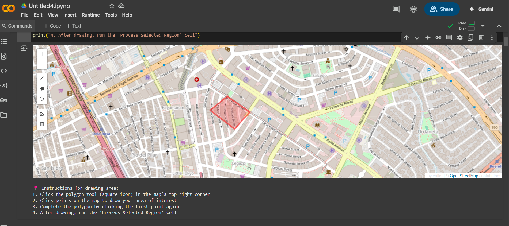
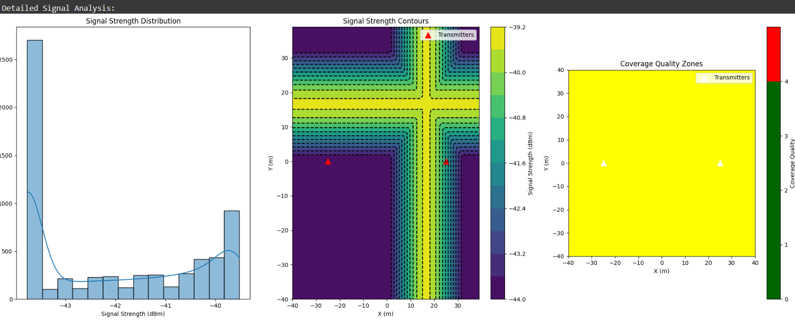

# 5G/6G Network Coverage Analysis and Optimization Tool 🛰️





## Overview
A sophisticated RF coverage analysis and optimization tool for 5G/6G networks that helps network engineers visualize and optimize signal propagation in complex environments.

## Technical Requirements🔧

### Prerequisites
```python
python_version >= "3.8"
dependencies = [
    "numpy",
    "matplotlib",
    "seaborn",
    "sionna-rt"
]
